# Arsitektur & Cara Kerja PowerPoint Bridge 🖥️🔌

Dokumen ini menjelaskan secara detail dan teknikal arsitektur komunikasi dua arah (*bidirectional*) serta alur data antara **SION Link Desktop** (Client/Sender) dan **SION Media Desktop** (Server/Receiver).

---

## 1. Diagram Alur Data Ringkas (Mermaid)

```mermaid
sequenceDiagram
    autonumber
    participant PPT as MS PowerPoint
    participant SL as SION Link (Client)
    participant SM as SION Media (Server)
    participant UI as SION Media UI (Operator)

    Note over SL, SM: Fase 1: Autentikasi & Polling Heartbeat
    SL->>SM: HTTP GET /api/powerpoint-bridge/request (heartbeat & polling perintah)
    SM-->>SL: HTTP 200 { status: 'approved', pendingCommands: [] }

    Note over SL, PPT: Fase 2: Deteksi Perubahan Slide
    loop Setiap 500ms
        SL->>PPT: Query Active Slide Index (via COM/OLE)
        PPT-->>SL: Slide Index: 4, Deck: "KKR Malam 4.pptx"
    end

    Note over SL, PPT: Fase 3: Pembuatan & Pengiriman Visual (JPEG)
    rect rgb(30, 41, 59)
        Note left of SL: Jika Slide Index berubah
        SL->>PPT: Ekspor Slide 4 & 5 sebagai JPEG (1920x1080)
        PPT-->>SL: Simpan file temp JPG
        SL->>SL: Konversi JPG ke Base64 Data URL
        SL->>SM: HTTP POST /api/presentation-source (Base64 + Slide Metadata)
    end
    SM->>SM: Validasi Header JPEG (FF D8 FF)
    SM->>SM: Simpan ke disk (userData/presentation-source)
    SM->>SM: Hapus berkas slide lama secara asinkron
    SM->>UI: IPC Broadcast (Update visual preview/live)

    Note over UI, SL: Fase 4: Kontrol Navigasi Jauh (Bidirectional)
    UI->>SM: Klik "Slide Berikutnya" (Prev/Next)
    SM->>SM: Simpan perintah ke Antrean (Command Queue)
    SL->>SM: HTTP GET /api/powerpoint-bridge/request (Heartbeat berikutnya)
    SM-->>SL: HTTP 200 { pendingCommands: ['NEXT'] }
    SL->>PPT: Panggil Metode COM .Next()
    PPT->>PPT: Slide berpindah ke halaman berikutnya
```



---

## 2. Analisis Teknikal Komponen

### A. SION Link Desktop (Client / Sisi Laptop Pemateri)
SION Link Desktop berjalan di atas **Electron (Node.js)** dan bertindak sebagai *bridge* native antara sistem operasi Windows (COM API) dan server HTTP SION Media.

#### 1. Windows COM Interop via PowerShell
Microsoft PowerPoint menggunakan model objek berbasis **COM (Component Object Model)**. Karena Node.js tidak memiliki pustaka interop COM bawaan yang stabil tanpa dependensi C++ native yang berat, SION Link memanggil **PowerShell** secara *out-of-process* dengan perintah yang disandikan Base64 (`-EncodedCommand`) menggunakan UTF-16LE:
```typescript
const child = spawn('powershell.exe', [
  '-NoLogo', '-NoProfile', '-NonInteractive', '-EncodedCommand', encodedScript
])
```
Skrip PowerShell mengaitkan dirinya ke instans PowerPoint yang sedang berjalan di sistem operasi menggunakan marshaling runtime:
```powershell
$ppt=[Runtime.InteropServices.Marshal]::GetActiveObject('PowerPoint.Application')
$window=$ppt.SlideShowWindows.Item(1)
$view=$window.View
$deck=$window.Presentation
$slide=$view.Slide
```

#### 2. Optimasi Kinerja "Export-on-Change" & 500ms Polling
Untuk memberikan respons instan tanpa membebani CPU, SION Link menerapkan logika pembanding di tingkat Node.js dan PowerShell:
*   **Heartbeat Polling:** Polling berjalan setiap **500ms** untuk mendeteksi perubahan navigasi slide secepat mungkin.
*   **Stateful Arguments:** SION Link mengirimkan nama presentasi (`deckName`) dan indeks slide terakhir yang dikirim ke skrip PowerShell.
*   **Pencegahan I/O Disk Berlebih:** PowerShell membandingkan parameter masukan tersebut dengan keadaan aktif PowerPoint saat ini:
    ```powershell
    $changed = ($deckName -ne '$lastDeck') -or (($idx - 1) -ne $lastIndex)
    ```
    Jika `$changed` bernilai `false`, PowerShell melewati proses ekspor gambar dan langsung mengembalikan JSON kosong. Ini mencegah penulisan konstan file JPEG berukuran besar ke hard disk (SSD) saat pemateri sedang diam di satu slide.

#### 3. Kompresi JPEG Cerdas
Jika slide berubah, skrip memanggil metode ekspor PowerPoint asli untuk menghasilkan visual beresolusi 1080p:
```powershell
$slide.Export('$framePath','JPG',1920,1080)
```
Menggunakan format **JPEG** alih-alih **PNG** berhasil memotong ukuran payload dari rata-rata **1.5MB - 3.2MB menjadi hanya 120KB - 200KB per slide**, meminimalkan penggunaan Wi-Fi lokal secara signifikan.

---

### B. SION Media Desktop (Server / Sisi Layar Operator)
SION Media bertindak sebagai server HTTP lokal yang memproses data visual slide dan mengelola antrean perintah kontrol.

#### 1. Verifikasi Keamanan & Alokasi Memori
Saat server menerima payload base64 di endpoint `/api/presentation-source`, ia melewati parser ekspresi reguler (Regex) untuk menghindari *backtracking stack limit* pada engine V8. Sebagai gantinya, ia menggunakan manipulasi string manual yang sangat cepat:
```typescript
const base64Data = imageDataUrlStr.substring(23) // Memotong prefix "data:image/jpeg;base64,"
const image = Buffer.from(base64Data, 'base64')
```
Untuk mengamankan memori server dari serangan kehabisan memori (*buffer overflow*), server memvalidasi rentang ukuran file (harus di bawah 8MB) dan memverifikasi tanda tangan header biner JPEG (SOI - Start of Image) secara langsung:
```typescript
const isJpeg = image.length >= 3 && image.subarray(0, 3).toString('hex') === 'ffd8ff'
```

#### 2. Pencegahan File Lock (`EBUSY` Avoidance) & Disk Cleanup
Agar file gambar slide dapat diperbarui tanpa error `EBUSY` (terjadi ketika Windows mengunci file gambar yang sedang dibaca oleh tag `` di Chromium saat ditulis ulang), server menggunakan skema berkas dinamis:
```typescript
const imagePath = `${sourceDir}\\${safeDeviceId}-current-${timestamp}.jpg`
```
Dengan membuat file baru setiap kali slide berubah, server tidak pernah menimpa file yang sedang digunakan. File lama dibersihkan secara asinkron setelah file baru sukses ditulis ke disk:
```typescript
setTimeout(() => {
  cleanupOldSlideFiles(safeDeviceId, imagePath, nextImagePath)
}, 50)
```

#### 3. Sinkronisasi Otomatis ke LIVE (Auto-Live Engine)
Di sisi renderer frontend React, `App.tsx` mendengarkan event IPC `PRESENTATION_SOURCE`. Ketika slide baru terdeteksi:
1. State visual disimpan ke Store (`usePowerPointBridgeStore`).
2. Aplikasi memeriksa metadata LIVE saat ini:
   ```typescript
   const isCurrentlyLive = useProjectionStore.getState().programSongMeta?.hymnalCode === 'PPT LIVE'
   ```
3. Jika mode PowerPoint Bridge sedang tayang secara aktif di layar proyeksi utama (`PPT LIVE`), render engine langsung menembakkan perintah `loadPowerPointBridgeSource(bridgeSource, true)` untuk memproyeksikan visual slide baru ke layar Program secara instan.

---

### C. Alur Navigasi Balik (Bidirectional Control)
Mekanisme ini memungkinkan operator SION Media memindahkan slide PowerPoint di laptop pemateri dari jarak jauh:

1. **Pengiriman Perintah di UI:** Saat operator mengklik "Slide Berikutnya" di panel SION Media, ia memicu IPC call ke main process.
2. **Antrean Perintah (Queue):** Server menyimpan perintah navigasi ke dalam peta antrean perangkat:
   ```typescript
   powerPointBridgeCommandQueues.get(deviceId).push('NEXT')
   ```
3. **Heartbeat Fetch:** Di sisi client, `ensurePresentationBridgeApproval()` di SION Link secara berkala (500ms) memanggil GET request ke `/api/powerpoint-bridge/request` untuk memeriksa apakah koneksi masih sah.
4. **Respon Perintah:** Server menyertakan daftar perintah tertunda (`pendingCommands`) dalam respon HTTP dan segera menghapus antrean tersebut.
5. **Eksekusi COM:** SION Link menerima array `pendingCommands`, lalu mengeksekusi metode navigasi PowerPoint secara lokal:
   ```powershell
   $view.Next()
   ```
   PowerPoint berpindah halaman, dan pada interval polling 500ms berikutnya, SION Link akan mendeteksi perubahan indeks slide, mengekspor gambar baru, dan mengirimkannya kembali ke server.
